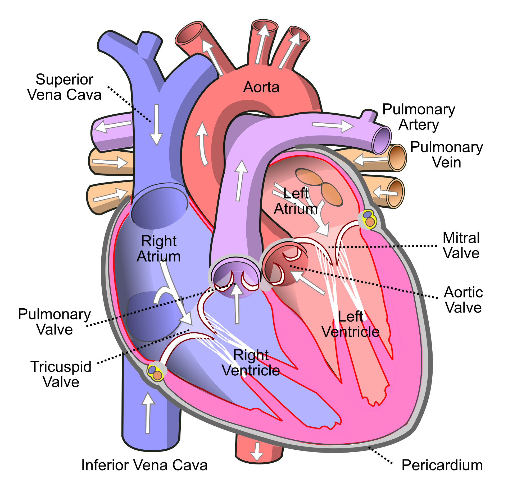

The result of a quantitative analysis is a list of peptide and/or protein abundances for every protein in different samples, or abundance ratios between the samples. In this chapter we will extend our generic workflow for differential analysis of quantitative datasets with more complex experimental designs.

We will start with assessing the impact of sample size. Then we will introduce the concept of blocking and we will continue with the analysis of a subset of the mouse diet data. 

# Breast cancer example

Eighteen Estrogen Receptor Positive Breast cancer tissues from from patients treated with tamoxifen upon recurrence have been assessed in a proteomics study. Nine patients had a good outcome (or) and the other nine had a poor outcome (pd).
The proteomes have been assessed using an LTQ-Orbitrap in data dependent acquisition (DDA) mode and the thermo output .RAW files were searched with MaxQuant (version 1.4.1.2) against the human proteome database (FASTA version 2012-09, human canonical proteome). 

The raw data can be found in the folder dda/cancer after downloading and unzipping 
all data locally. [Download data](https://github.com/statOmics/msqrob2data/archive/refs/heads/main.zip)

Preprocessed data are also already stored as QFeatures objects. They can be loaded in R using readRDS or directly with the launchMsqrob2ModelingApp(). So you only have to read the data and you can start with section 5 Data exploration in the basic script or in the  GUI. 

```{r eval=FALSE}
qf <- readRDS(url("https://github.com/statOmics/PDA-DIA/raw/refs/heads/main/data/cancer3x3.rds","rb"))
```

Three QFeatures objects are available (you can simply modify the url above replacing the filename):

1. For a 3 vs 3 comparison: cancer3x3.rds
2. For a 6 vs 6 comparison: cancer6x6.rds
3. For a 9 vs 9 comparison: cancer9x9.rds


# Blocking: Mouse T-cell example

[@DuguetEtAl2017] compared the proteomes of mouse regulatory T cells (Treg) and conventional T cells (Tconv) in order to discover differentially regulated proteins between these two cell populations. For each biological repeat the proteomes were extracted for both Treg and Tconv cell pools, which were purified by flow cytometry. The data in data/quantification/mouseTcell on the [PDA-data repository](https://github.com/statOmics/PDA25EBI/archive/refs/heads/data.zip) are a subset of the data [PXD004436](https://www.ebi.ac.uk/pride/archive/projects/PXD004436) on PRIDE.


The proteomes have been assessed using data dependent acquisition (DDA) mode. 

Three subsets of the data are available:

- peptidesCRD.txt: contains data of Tconv cells for 4 bio-repeats and Treg cells for 4 bio-repeats
- peptidesRCB.txt: contains data for 4 bio-repeats only, but for each bio-repeat the Treg and Tconv proteome is profiled.   
- peptides.txt: contains data of Treg and Tconv cells for 7 bio-repeats

Users using R-scripts can import the data using following links:

```
https://github.com/statOmics/msqrob2data/raw/refs/heads/main/dda/mouseTcell/peptidesCRD.txt
https://github.com/statOmics/msqrob2data/raw/refs/heads/main/dda/mouseTcell/peptidesRCB.txt
https://github.com/statOmics/msqrob2data/raw/refs/heads/main/dda/mouseTcell/peptides.txt
```

Users with the GUI can find the datasets in directory dda/mouseTcell after
downloading and unzipping the data ([Download data](https://github.com/statOmics/msqrob2data/archive/refs/heads/main.zip)).

1. How would you analyse the CRD data?

2. How would you analyse the RCB data?

3. Try to explain the difference in the number of proteins that can be discovered with both designs?

# Block design with multiple factors: Heart example 



Researchers have assessed the proteome in different regions of the heart for 3 patients (identifiers 3, 4, and 8). For each patient they sampled the left atrium (LA), right atrium (RA), left ventricle (LV) and the right ventricle (RV). The data are a small subset of the public dataset  [PXD006675](https://www.ebi.ac.uk/pride/archive/projects/PXD006675) on PRIDE.

Suppose that researchers are mainly interested in comparing the ventricular to the atrial proteome.
Particularly, they would like to compare the left atrium to the left ventricle, the right atrium to the right ventricle, the average ventricular vs atrial proteome and if ventricular vs atrial proteome shifts differ between left and right heart region.

Adjust the script [Rmarkdown script](./staes-median-maxLFQ.html) or perform the analysis using the [GUI](./cptac_robust_gui.html) . 
