# Introduction

Label-Free Quantitative mass spectrometry based workflows for differential 
expression (DE) analysis of proteins is often challenging due to 
peptide-specific effects and context-sensitive missingness of peptide 
intensities.

- `msqrob2` provides  peptide-based workflows that can assess for DE directly 
from peptide intensities and outperform summarisation methods which first 
aggregate MS1 peptide intensities to protein intensities before DE analysis.
However, they are computationally expensive, often hard to understand for the 
non-specialised end-user, and they do not provide protein summaries, which are 
important for visualisation or downstream processing.

- `msqrob2` therefore also proposes a novel summarisation strategy, which 
estimates MSqRob's model parameters in a two-stage procedure circumventing the 
drawbacks of peptide-based workflows.

- the summarisation based workflow in `msqrob2` maintains MSqRob's superior 
performance, while providing useful protein expression summaries for plotting 
and downstream analysis.
Summarising peptide to protein intensities considerably reduces the 
computational complexity, the memory footprint and the model complexity.
Moreover, it renders the analysis framework to become modular, providing users 
the flexibility to develop workflows tailored towards specific applications.

In this vignette we will demonstrate how to perform  `msqrob`'s summarisation 
based workflow  starting from a Maxquant search on a subset of the cptac 
spike-in study.

Examples on our peptide-based workflows and on the analysis of more complex 
designs can be found on our companion website 
[msqrob2 book](https://statomics.github.io/msqrob2book).

Technical details on our methods can be found in [@goeminne2016-tr], 
[@Goeminne2020], [@sticker2020-rl] and [@Vandenbulcke2025-sj].

# Background

This case-study is a subset of the data of the 6th study of the Clinical
Proteomic Technology Assessment for Cancer (CPTAC).
In this experiment, the authors spiked the Sigma Universal Protein Standard
mixture 1 (UPS1) containing 48 different human proteins in a protein background
of 60 ng/$\mu$L Saccharomyces cerevisiae strain BY4741.
Two different spike-in concentrations were used:
6A (0.25 fmol UPS1 proteins/$\mu$L) and 6B (0.74 fmol UPS1 proteins/$\mu$L) [5].
We limited ourselves to the data of LTQ-Orbitrap W at site 56.
The data were searched with MaxQuant version 1.5.2.8, and
detailed search settings were described in @goeminne2016-tr.
Three replicates are available for each concentration.


## Installation instructions and setup

You can find the installation instructions for all required software
to run this exercise in [software](./index.html#software-and-data). 
Install:

- R and RStudio
- `QFeatures` to read and process mass spectrometry (MS) quantitative 
  data
- `msqrob2` to perform robust statistical inference for quantitative MS 
  proteomics
- `msqrob2gui` the GUI to msqrob2

Upon installation 


1. Open Rstudio, you will see the following window

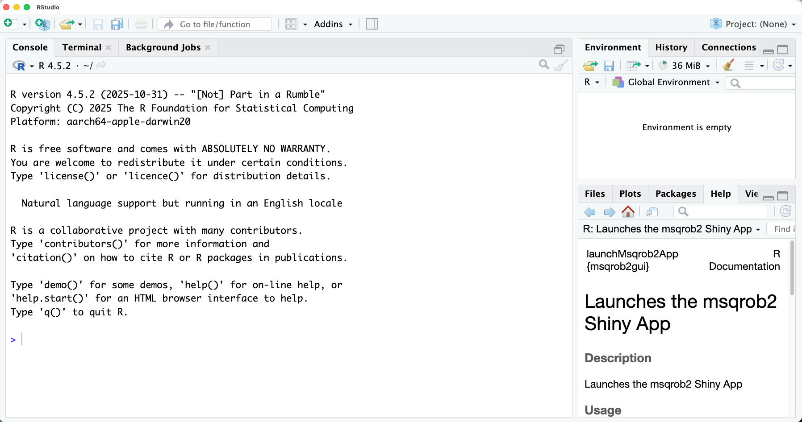


2. Copy and paste following commands in the console window and type enter

```{r, message=FALSE, warning=FALSE, eval = FALSE }
library(msqrob2gui)
options(shiny.maxRequestSize = 500 * 1024^2)
launchMsqrob2App()
```

- The first line will load the `msqrob2gui` package and its
  dependencies (including `msqrob2`)
- The second line will increase the available the maximal RAM usage by 
  the application to 500 MB.
- The third line launches the msqrob2App with an end to end workflow

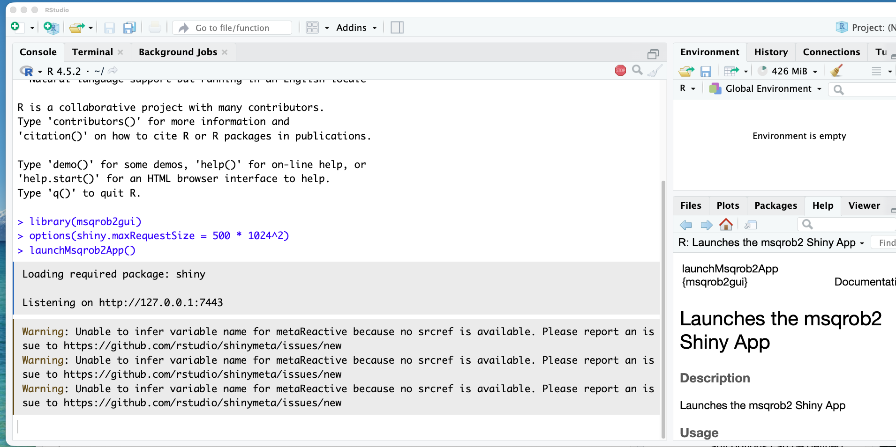


Note, that the shiny app opens in a new browser window. 

Note, that it is also possible to 

- open a modelling app (`launchMsqrob2DataProcessingApp()`) if you already 
have imported, data processed the raw data and stored it as a `QFeatures object`, 
e.g. with the QFeaturesGUI from the QFeatureGUI package that gives more 
flexibility to define your custom data processing workflow.  
- open an app for data exploration (`launchMsqrob2ExploreApp()`) if you already 
have a `QFeatures` object that you want to explore interactively. 

# Data preprocessing

Before analysing the data, we have to perform data preprocessing. This to ensure 
the data meet our model assumptions. 

## Import the data

Our MS-based proteomics data analysis workflows always start with 2 
pieces of data: 

1. The search engine output. In this tutorial, we will use the
   identified and quantified peptide data by DIA-NN, called
   `spikein248-staesetal2024.parquet`.
2. An annotation file describing the experimental design. Each line
   corresponds to a sample and each column provides a sample 
   annotation.

The first step is to upload the `spikein248-staesetal2024.parquet` file. 
This is the file that contains your precursor-level intensities. Note that the
file is in long format. 
You can chose between four search software options, DIA-NN, Spectronaut, MaxQuant 
and Other (for any search engine with data in tabular format). 

Here we choos DIA-NN. 
To upload the `spikein248-staesetal2024.parquet` file, click on the "Browse..."
button under the "Input file" tile title.  A preview of the table will appear 
and will let you quickly check the data.

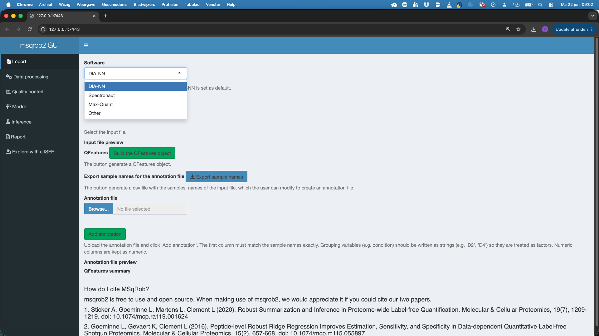

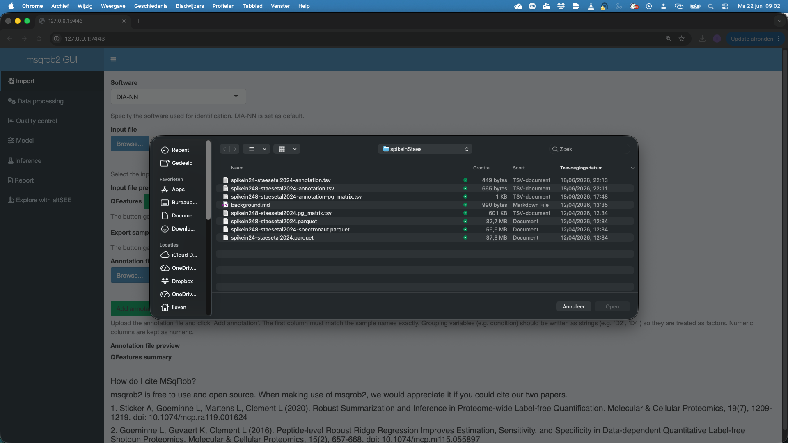

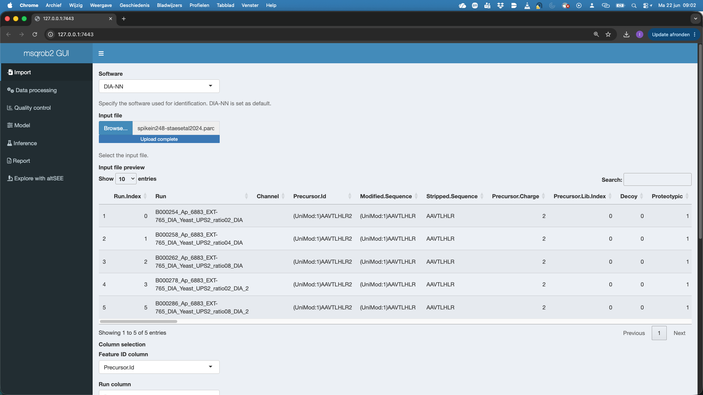

The GUI recognizes the DIA-NN parquet format and selects The Feature ID column,
Run Column and Intensity Column. 
Note, that by default the `Intensity Column` is set at `Precursor.Quantity`. 
If users want to use the internal normalisation in DIA-NN, they can modify the 
Intensity Column to `Precursor.Normalised`.

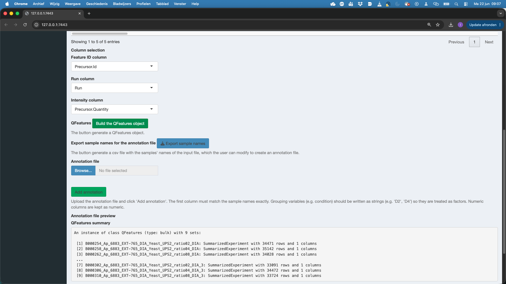

We notice that a QFeatures object is generated. 

We will now also add the annotation file with information on the experimental 
design. 
If you have no annotation file yet, you can click the button "export sample names"
this will provide an annotation.tsv file that contains just the sample names. 
You can then complete the information on the design by adding additional columns,
one column for each design variable, and inputting the corresponding value for 
the design variable for each sample. 
The annotation file can be in tsv or csv format. 

Here, the annotation file is already available. 
So we click `Browse` under `Annotation file` and select the annotation file
`spikein248-staesetal2024-annotation.tsv`. 
Again a preview of the annotation file is provided. 
*Do not forget to push the button* `Add Annotation` to add the information in 
the annotation file to the QFeatures object! 

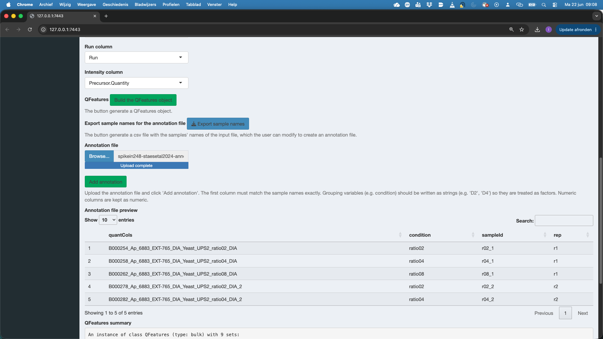

## Data Processing

We now proceed to the data processing tab. 
The data processing tab already contains some pre-filled in options for filtering
and data aggregation as we indicated that we imported data from DIA-NN software. 

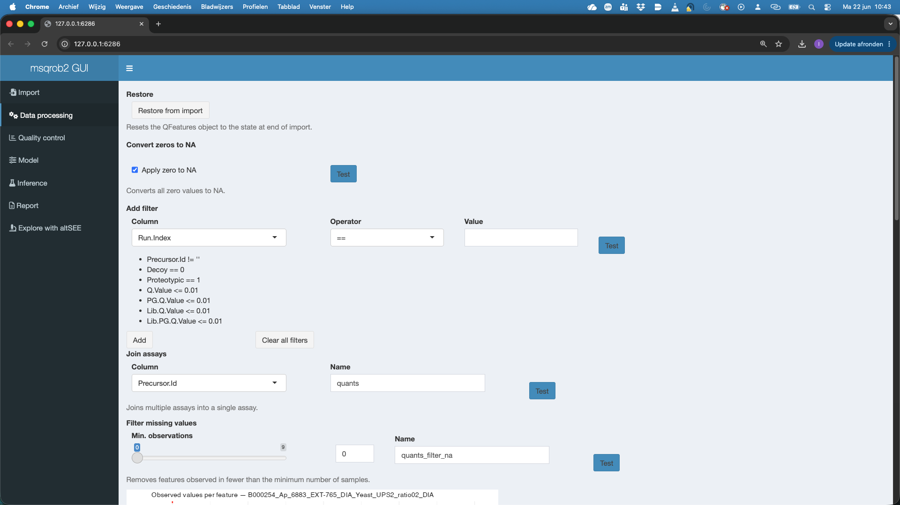


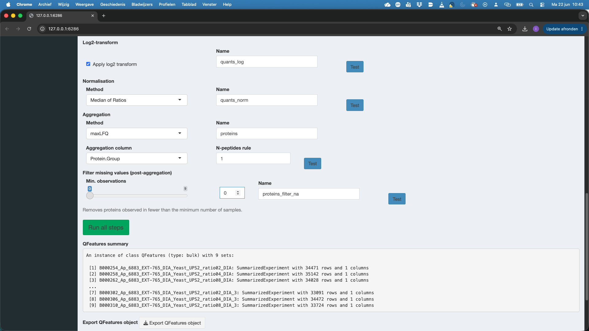


1. First we can restore the QFeatures object from import. This is something that 
we always have to do if we change the data processing settings and want to redo the 
data processing. 

2. We can convert zeros to NA. This is important. Many softwares encode missing 
data with 0 intensity. If we want to address missingness and/or want to log-transfrom
the data we have to convert the zeros to NA. You can hit the test button to test 
this setting. 

3. We filter the data. We can add filters to the data based on the columns that 
contain information on the imported quant features. For DIA-NN, Spectronaut and 
MaxQuant we already provide sensible defaults. E.g. 

    - Precursor.Id != '': we remove features for which the precursor was not set
    - Decoy == 0: we keep precursors that map to target sequences (decoys are indicated with 1)
    - Proteotypic == 1: we only keep precursors that are proteotypic (uniquely map to a single protein)
    - Q.Value <= 0.01: we keep features for which the Q-Value for identification is below an 1% FDR threshold. 
    - PG.Q.Value <= 0.01: we keep features for which the protein group level Q-Value for identification is below an 1% FDR threshold
    - Lib.Q.Value <= 0.01: we keep features that were identified by matching between runs if their Q-Value for identification is below an 1% FDR threshold
    - Lib.PG.Q.Value <= 0.01: we keep features that were identified by matching between runs if their protein group level Q-Value for identification is below an 1% FDR threshold
    - Users can add additional filtering criteria. 
    
- For maxQuant this for instance becomes 

    - Proteins != '': we remove precursors that have not been mapped to a protein (!= --> is not equal to)
    - Reverse != '+': we remove precursors that are matched to decoys sequences
    - Contaminants != '+' or Potential.contaminant != '+': we remove precursors are matched to contaminants (variable name for contaminants depends on MaxQuant version and is automatically detected). 
    
4. Join assays: DIA-NN parquet files are in long format, then each run is stored in a different set. The sets can be joined so that we have all data for all samples/runs in the same set. By default we join the sets by using the Precursor.Id column. The joined set is by default stored as the set named `quants`. Users however can change this name. 

5. Filter missing values: we can only estimate precursor or peptide characteristics if we have observed them in multiple samples. Here we will set this . If you have launched the previous test buttons, you will also see the number of features that were observed in 1, 2, 3, ... samples. Here we will set the minimum number observations at `3`.

6. Log-transformation. Intensities quantified with MS are typically heteroscedastic (variance increase with the mean) and log-transformation is known to stabilise this. So by default we contact log-tranformation. Note, that you can switch this off if the data were already log-transformed. 

7. Normalisation. By default we conduct `Median of Ratios normalisation`, which corrects for differences in loading between runs, as well as for differences in composition. If you use internal normalisation in DIA-NN, e.g. by starting from `Precursor.Normalised` intensities you can also put the normalisation method on `None`.

8. Aggregation. The data are often at the precursor, PSM or peptide level. However we want typically want to conduct the differential analysis at the protein level. So we first aggregate the data. We typically use a method that does the aggregation while accounting for the feature characteristics. `MaxLFQ` is a popular choice as `Method` for aggregation. The implementation in R is rather slow, so for large datasets we advice `medianPolish`. If the data are already summarized or if you would like to do inference at the precursor or peptide level you can omit the Aggregation by selecting `None`. Note that we also have to indicate the variable that contains information of features that belong to the same protein. For DIA-NN we set this `Aggregation column` to `Protein.Group` by default. We can again select the `Name` of the assay, which is by default set at `proteins`. Note, that we can also adopt an `N-peptides rule`. If we set it higher than 1, we will require at least #n peptides to be identified for each summarised protein quantity otherwise the protein quantity is set at NA. 

9. The last step is again filtering missing values post-aggregation. Here, we want to do a two group comparison, so we would need to have at least 4 protein level summaries to be able to compare two groups. 

# Quality control

We can now perform quality control of all the assays in the quality control tab. 
By default the first Assay is selected.

*It is important to wait until the data is loaded, before selecting/changing the assay 
otherwise the app can crash* 

1. Here we will select the `quants_log` assay first, which are the filtered, 
log2-transformed precursor-level quantities. 

We will color the plots according to the `condition`. 

Note, that we get plots for both all features and the common features, i.e. 
features observed in each sample. Both plots show that the data need normalisation. 

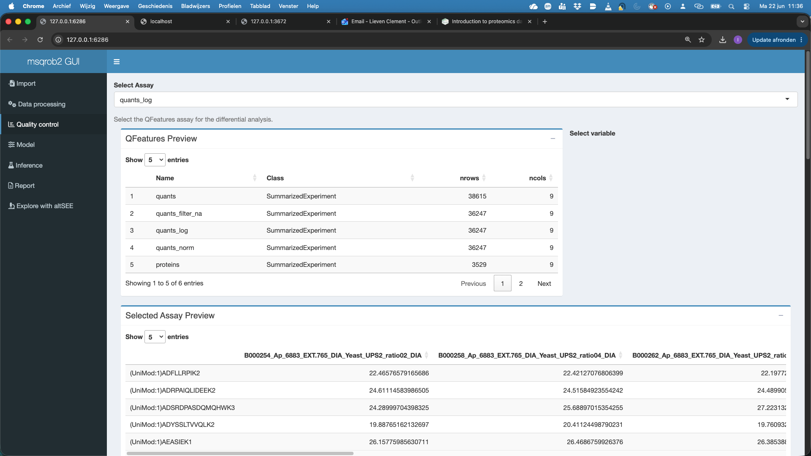

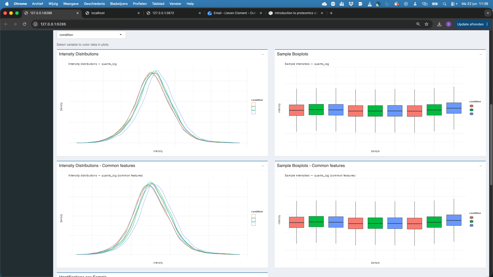


2. We now change the assay to `quants_norm` which are the filtered, 
log2-transformed and normalised precursor-level quantities.  We observe that upon
medianOfRatio normalisation, the distributions of both all features and the common features
are comparable. 

We also observe that the number of identified features per sample is also comparable. 

We now perform Dimensionality reduction. We have to hit the `Run` button first. 
Note, that we have to rerun the Run button each time we change the assay. We see 
that the samples align somewhat according to the spikein condition.

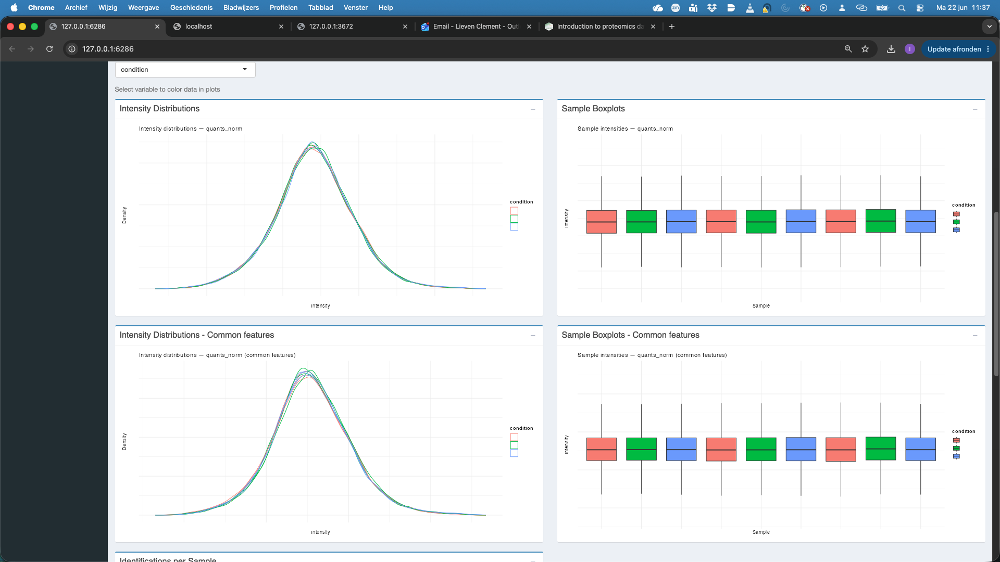

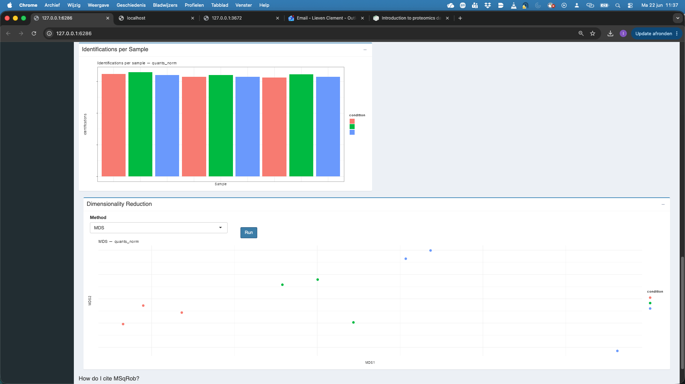


3. We now change the assay to `proteins_filter_na` which are the filtered, 
log2-transformed, normalised and aggregated protein-level quantities.  
We observe that also at the protein level the distribution of all features and the 
common features nicely align. At the protein level the identifications per sample 
are also very comparable. If we rehit the `Run` button we also observe that 
the samples are better separated upon dimensionality reduction when starting from 
protein level summaries. 

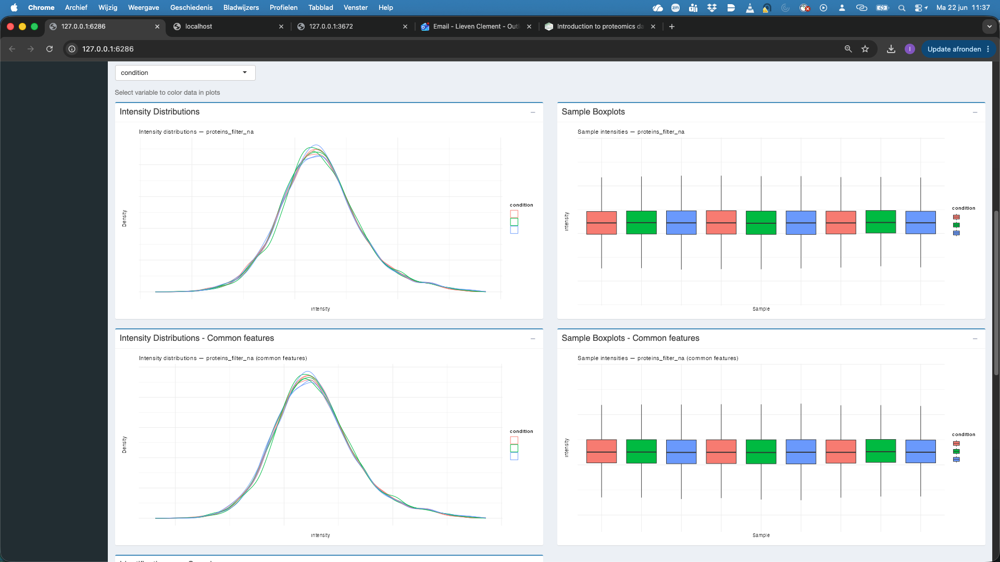


# Data Modeling

We will now model the data at the protein level. 

1. We select the `protein_filter_na` set in `Select Assay`
2. We can model the sources of variation in the data using the variables in the annotation file. 
   In this experimental design, we can model a single source of variation: spike-in concentration8. All remaining sources of variability, e.g. pipetting errors, MS run to run variability, etc will be lumped in the residual variability (error term). We can do this by using the variable condition. 
   We have to define a model formula for that. The model always starts with `~`. So we type `~ condition` in the `Design formula`. Note, that you can copy and paste the variable names that are listed below Build Model to avoid typing errors.
3. We can set the option `Ridge regression for fixed effects`, which is by default set at `No`. Ridge regression can stabilize the estimation of the model parameters. However, we only advice that for designs with many model parameters. 
4. We can set the option `Robust regression for fixed effects`, which is by default set at `Yes`. This robustifies the parameter estimation against outliers, which often occur in proteomics data. 
5. As soon as a valid model is formulated you will see that a plot appears under 
   Visualize Design. The plot shows the different means that are modeled. 
6. *Do not forget to hit the `Fit Model!`* button to fit the model for each feature of the selected assay.

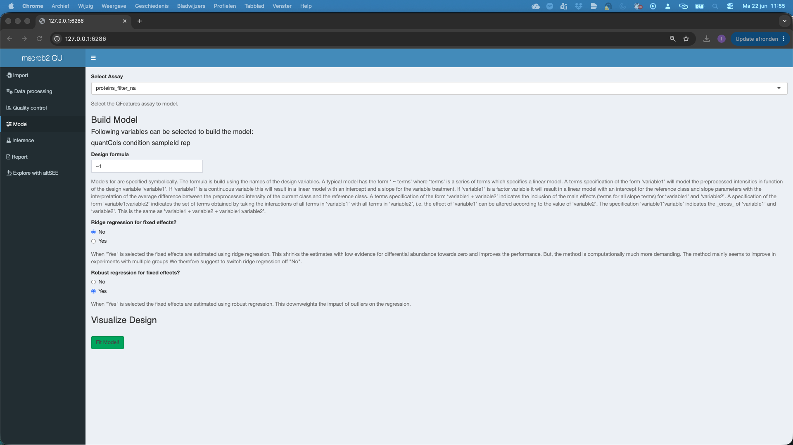

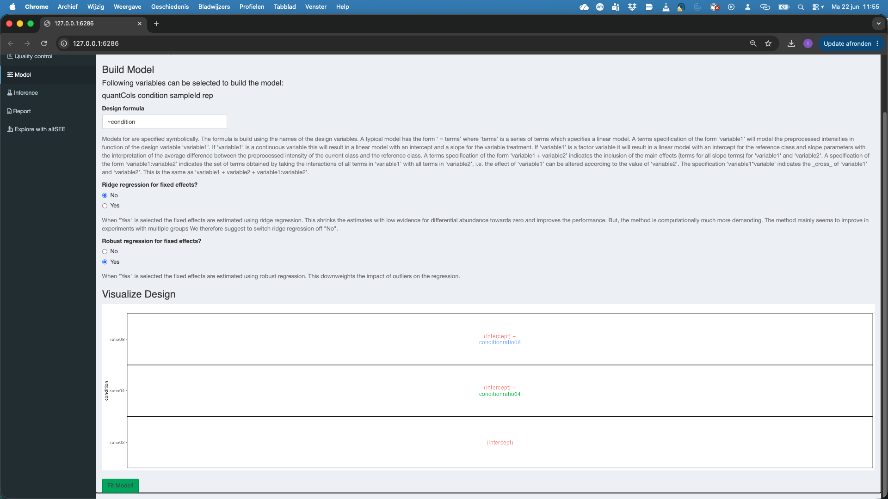

# Inference tab

We can now conduct formal hypothesis tests for each feature. We do this in the `inference tab`. 

We can `add contrasts`, which define the null hypothesis for a research question using linear combinations of model parameters.

In our case we would like to prioritise proteins that are differentially abundant between conditions,
i.e. between ratio4 vs ratio2, ratio8 vs ratio2, and ratio 8 vs ratio 4. 

Since we model the data at the log scale, we know that the difference in mean between ratio4 and ratio2
is a $\log_2 FC$. I.e. $\log_2 FC^{4-2}= \mu_4 - \mu_2 =$ (intercept) + conditionratio04 - (intercept) = conditionratio04. So `conditionratio04 = 0` formulates the null hypothesis that a feature is not differentially abundant (DA) between condition 4 and condition 2. 

1. So we type `conditionratio04 = 0` in `Add contrast` and we push the `Add` button. We see that the contrast is added. 

2. We click `Test all contrasts`


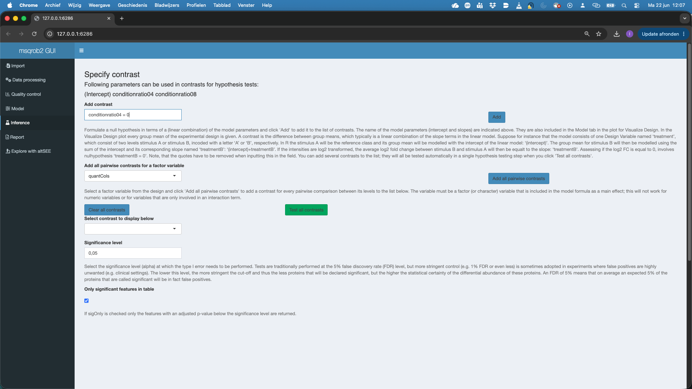


A volcano plot for the contrast appears along with a table with the DA features.
And a boxplot. 

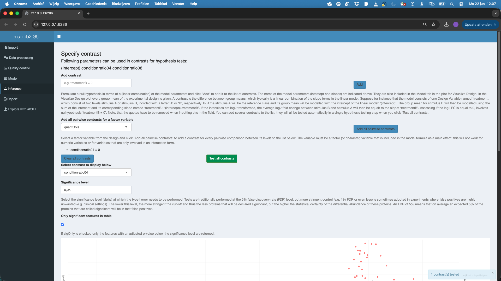


Note that all significant features are UPS proteins, which are spiked in. So at the 5% FDR we report all true positives. Also not that the red features (UPS proteins) in the volcanoplot are nicely centered around 1, which is the known fold change at the log scale: $\log_2(4/2) = 1$.

3. Note that you also can set the `Significance level` and can untick significant features in table, so as to see all features. 

4. Here, we are interested in testing multiple contrasts as we have to conduct 3 pairwise tests to assess all pairwise comparisons between the treatments. We could do this by defining the two additional contrasts and adding them. However, for factors that are additive in the model, we can also select the factor variable to `Add all pairwise contrasts for a factor variable` and click `Add all pairwise contrasts`. Note, that we first have to remove the contrast that we already defined, i.e. push the `clear all contrasts` button to avoid to add two times the same contrast. Note, that after hitting the `Test all contrasts` you can now explore the three contrasts. 

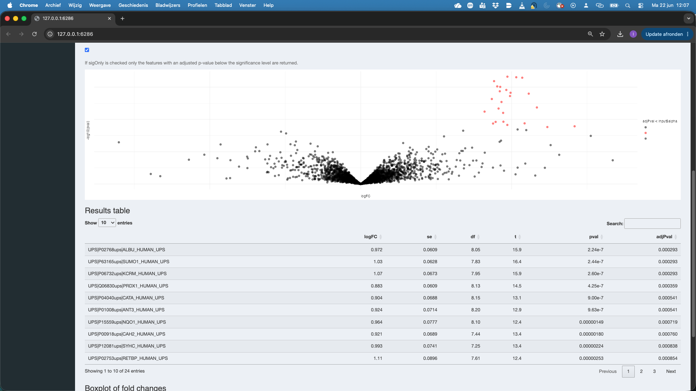


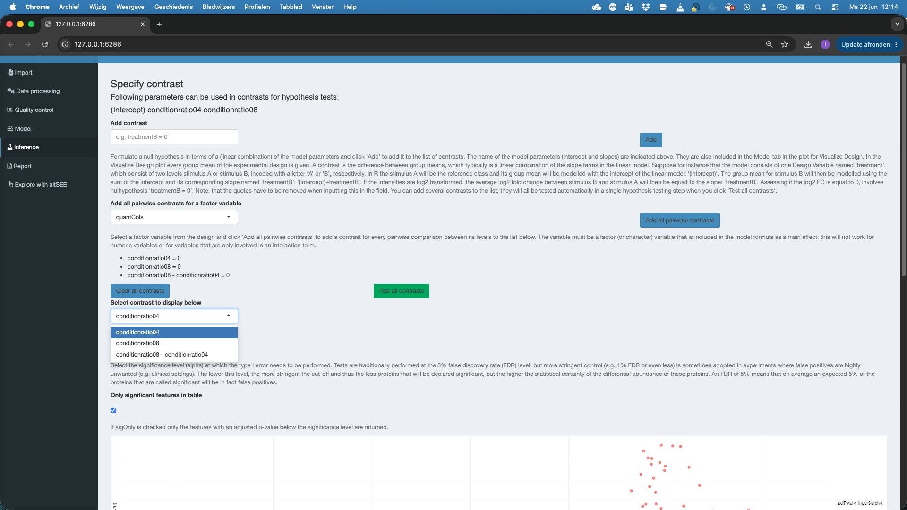


# Report tab

You can download a report for your data analysis. 

1. In the report tab you can give your report a name, e.g. staes248-spikein, by default it is named `project`. 
2. Then  hit the Generate full report bundle 
3. A screen will pop up and you will ask to choose a location to store the zip bundle. Note, that a timestamp is automatically added to your report name. 

If you unzip the bundle you will see that it contains: 

1. Input search results
2. Annotation file
3. Rmarkdown file for the data processing. 
4. Rmarkdown file for the modeling and inference. 
5. A table inference.tsv contain the results for all contrasts. 

So the entire data analysis can be documented in a fully reproducible way.

Note, that the scripts can also help you to learn how to setup and automate msqrob2 
data analysis workflows in a reproducible way using scripts. Note, that more info
in modeling with msqrob2 can also be found in our online e-book [msqrob2book](https://statomics.github.io/msqrob2book/). 

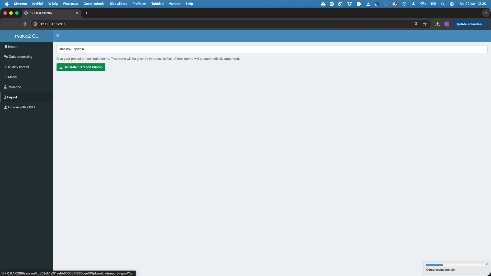


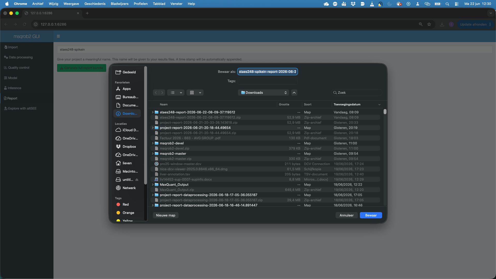

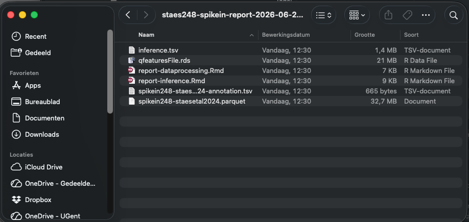


# Explore with altSEE tab

You can also explore the results interactively. 

1. Select the `Main experiment` (that is by default the assay selected for modeling)
2. Select the `Alt experiment` the is by default the first assay in the QFeatures object that differs from the `Main experiment` define in 1. Here we will select `quants_norm`
3. Optionally you can select the variable that will be used in the X-axis of the plots when starting the app (they can be changed in the app). Here, we choose the variable `sampleId`
4.  Optionally you can select the column that can link features between the Main experiment and the Alt experiment. Here, that is the `Protein.Group` that was used for aggregation. 
5. We hit the Launch iSEE button and a novel app will be prepared. That typically takes a while.
6. Once you see `Ready. Refresh the iSEE tab after re-launching, you can click the link and that will open the iSEE app in a new browser window. Again this can take a while. 

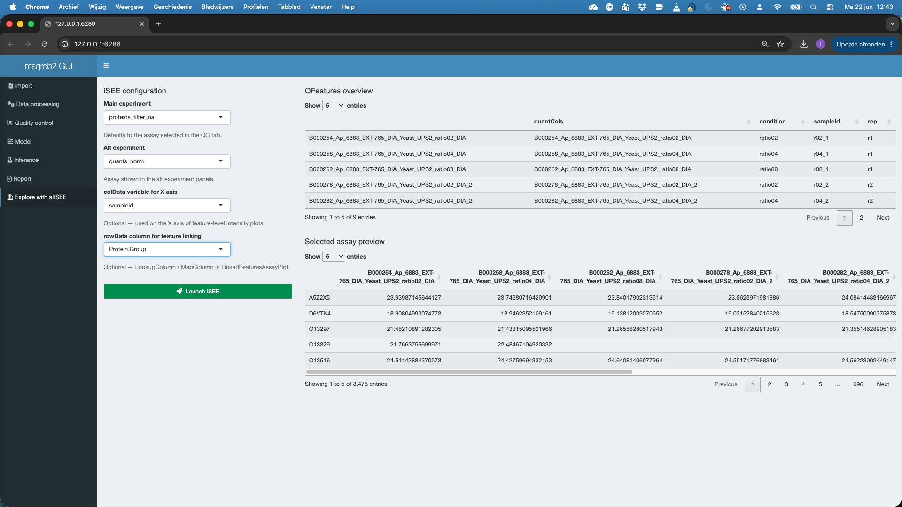


Once the iSEE app is open, we can interactively explore the data. 

1. The top panels show the reduced dimension plots for both the main and alt experiment. 
Note, that you can change the alt experiment, under data parameters, if you want to explore other assays. 

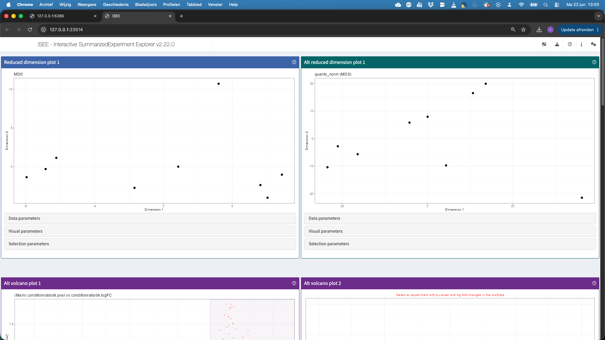


2. The second panels show volcano plots. Note, that we do not have a volcano plot for the altExp because we did not fit models at the precursor level. We can also select points in the volcano plot. These will then be selected in the table below, which is linked to the volcanoplot. 

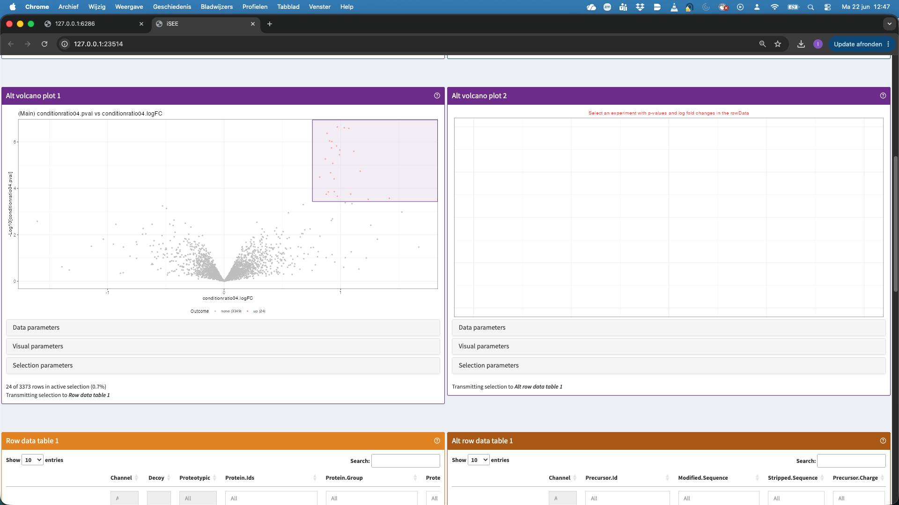

3. In the table now all significant hits are shown that we selected in the volcanoplot. We can select a hit in the table, but we first order the table according to the p.value. We now select the top hit.

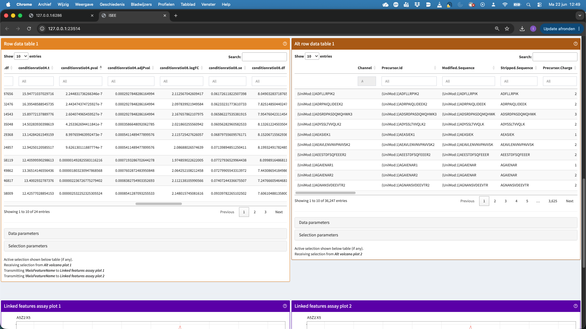

4. This hit will now be visualised in the bottom panels. The plots show the results for each feature that maps to the protein in the left data table (when starting the app, as a user you can change that). Features are connected with a line, in the default visualisation. 

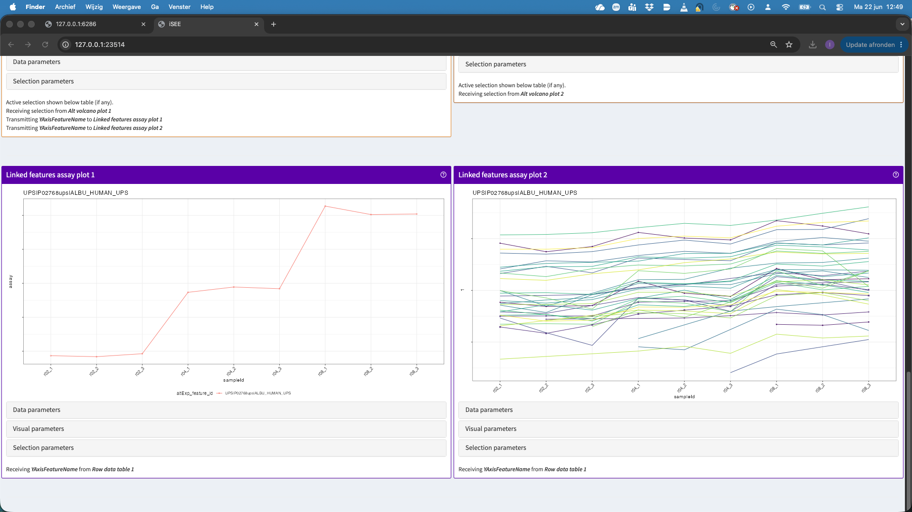

5. We can also change the plot layout, e.g. to show violin plots for the precursors. E.g click data parameters > Plot type > automatic. For factor variables in the x axis, by default we get a violin plot.  
You can also change the colors, split the panels, etc. When you play with the `Visualisation parameters`. You can click the `Question mark` next to the panel to get a panel tour.

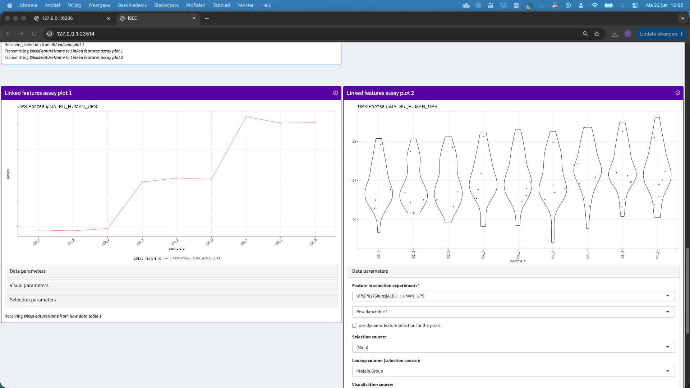

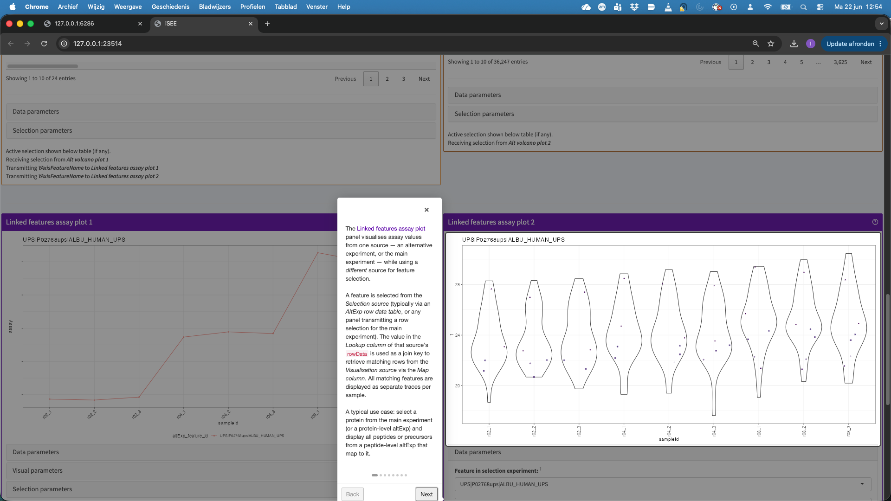

6. You can change the contrast by going back to the volcano plot and  click on Data parameters and select 
e.g., `conditionratio08.pval` and `conditionratio08.logFC`. You can now again select a region in the plot to display the features in the table below. You can also ask for a panel tour... 

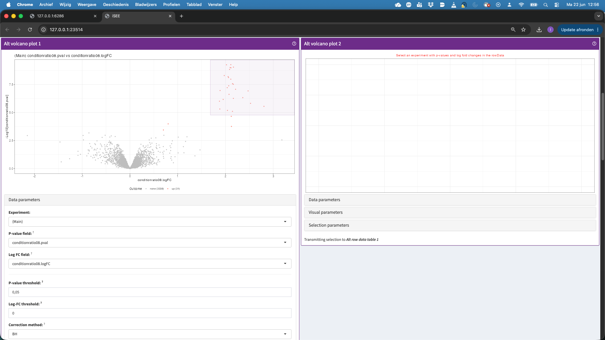
